# Perceptogram
Link to paper: [Perceptogram: Reconstructing Visual Percepts from EEG](https://arxiv.org/abs/2404.01250)

+ Overview:

<!-- 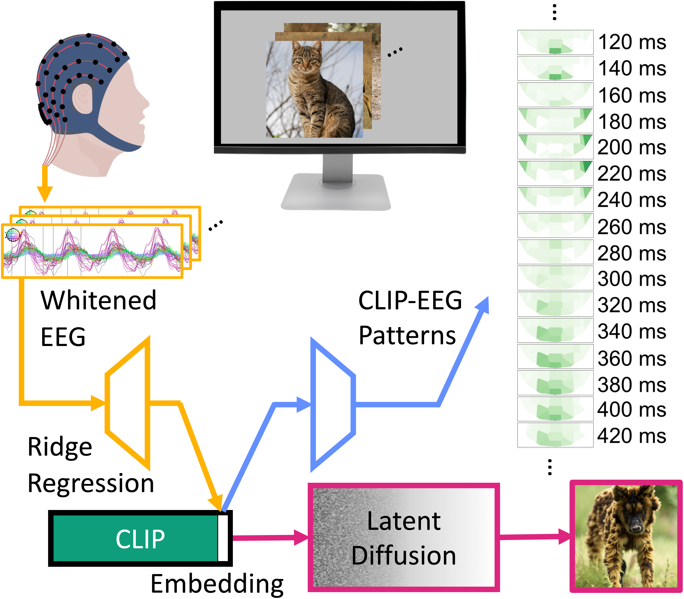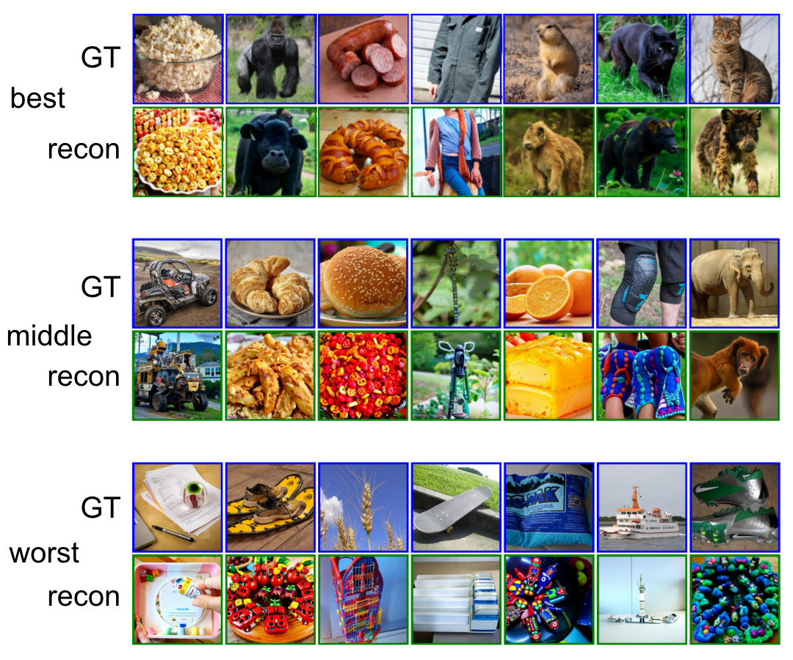 -->


+ EEG patterns show spatial alignment with fMRI patterns:

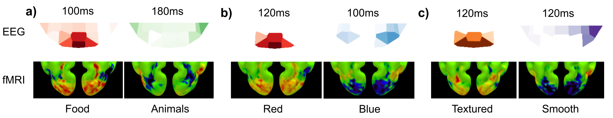

## THINGS-EEG2 — unCLIP Pipeline:

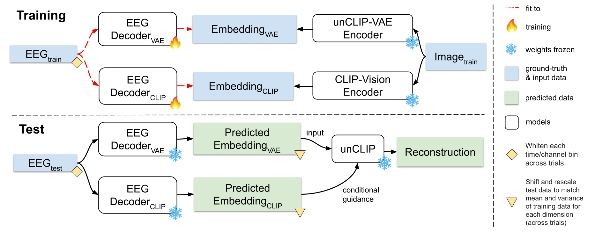

### Setup

1. Create the python environment

+ For mac and linux:
```
virtualenv pyenv --python=3.10.12
source pyenv/bin/activate
pip install -r requirements.txt
cp scripts-thingseeg2_dataprep/pipeline_stable_unclip_img2img_modified.py pyenv/lib/python3.10/site-packages/diffusers/pipelines/stable_diffusion/pipeline_stable_unclip_img2img.py
```
+ For Windows:
```
virtualenv pyenv --python=3.10.12
pyenv-vd\Scripts\activate
pip install -r requirements.txt
move scripts-thingseeg2_dataprep\pipeline_stable_unclip_img2img_modified.py pyenv\Lib\site-packages\diffusers\pipelines\stable_diffusion\pipeline_stable_unclip_img2img.py
```

2. Download [preprocessed eeg data](https://osf.io/anp5v/), unzip "sub01", "sub02", etc under data/thingseeg2_preproc.

+ For mac and linux:
```
cd data/
wget -O thingseeg2_preproc.zip https://files.de-1.osf.io/v1/resources/anp5v/providers/osfstorage/?zip=
unzip thingseeg2_preproc.zip -d thingseeg2_preproc
rm thingseeg2_preproc.zip
cd thingseeg2_preproc/
for i in {01..10}; do unzip sub-$i.zip && rm sub-$i.zip; done
cd ../../
python scripts-thingseeg2_dataprep/prepare_thingseeg2_data.py 
```
+ For Windows:
```
cd data/
curl.exe -o thingseeg2_preproc.zip https://files.de-1.osf.io/v1/resources/anp5v/providers/osfstorage/?zip=
Expand-Archive -Path thingseeg2_preproc.zip -DestinationPath thingseeg2_preproc
cd thingseeg2_preproc
Expand-Archive -Path sub-01.zip -DestinationPath .
Expand-Archive -Path sub-02.zip -DestinationPath .
Expand-Archive -Path sub-03.zip -DestinationPath .
Expand-Archive -Path sub-04.zip -DestinationPath .
Expand-Archive -Path sub-05.zip -DestinationPath .
Expand-Archive -Path sub-06.zip -DestinationPath .
Expand-Archive -Path sub-07.zip -DestinationPath .
Expand-Archive -Path sub-08.zip -DestinationPath .
Expand-Archive -Path sub-09.zip -DestinationPath .
Expand-Archive -Path sub-10.zip -DestinationPath .
cd ../../
python scripts-thingseeg2_dataprep/prepare_thingseeg2_data.py 
```

3. Download [ground truth images](https://osf.io/y63gw/), unzip "training_images", "test_images" under data/thingseeg2_metadata
+ For mac and linux:
```
cd data/
wget -O thingseeg2_metadata.zip https://files.de-1.osf.io/v1/resources/y63gw/providers/osfstorage/?zip=
unzip thingseeg2_metadata.zip -d thingseeg2_metadata
rm thingseeg2_metadata.zip
cd thingseeg2_metadata/
unzip training_images.zip
unzip test_images.zip
rm training_images.zip
rm test_images.zip
cd ../../
python scripts-thingseeg2_dataprep/save_thingseeg2_images.py
python scripts-thingseeg2_dataprep/save_thingseeg2_concepts.py
```
+ For Windows:
```
cd data/
curl.exe -o thingseeg2_metadata.zip https://files.de-1.osf.io/v1/resources/y63gw/providers/osfstorage/?zip=
Expand-Archive -Path thingseeg2_metadata.zip -DestinationPath thingseeg2_metadata
cd thingseeg2_metadata
Expand-Archive -Path training_images.zip -DestinationPath .
Expand-Archive -Path test_images.zip -DestinationPath .
del training_images.zip
del test_images.zip
cd ../../
python scripts-thingseeg2_dataprep/save_thingseeg2_images.py
python scripts-thingseeg2_dataprep/save_thingseeg2_concepts.py
```

5. Extract train and test latent embeddings from images
```
python scripts-thingseeg2_dataprep/extract_features-clip.py
python scripts-thingseeg2_dataprep/extract_features-vae.py
python scripts-thingseeg2_dataprep/evaluation_extract_features_from_test_images.py
```

### Training and reconstruction
```
python scripts-thingseeg2/train_regression_clip.py 
python scripts-thingseeg2/train_regression_vae.py
python scripts-thingseeg2/reconstruct_from_embeddings.py 
python scripts-thingseeg2/evaluate_reconstruction.py 
python scripts-thingseeg2/plot_reconstructions.py -ordered True
```

### PCA and ICA reconstructions
1. Download ImageNet64 dataset
+ For mac and linux:
```
mkdir data/imagenet64/
wget -O data/imagenet64/imagenet64_train_part1_npz.zip https://image-net.org/data/downsample/Imagenet64_train_part1_npz.zip
wget -O data/imagenet64/imagenet64_train_part2_npz.zip https://image-net.org/data/downsample/Imagenet64_train_part2_npz.zip
wget -O data/imagenet64/imagenet64_val_npz.zip https://image-net.org/data/downsample/Imagenet64_val_npz.zip
unzip data/imagenet64/imagenet64_train_part1_npz.zip -d data/imagenet64/
for i in {1..5}; do mv data/imagenet64/Imagenet64_train_part1_npz/train_data_batch_$i.npz data/imagenet64/train_data_batch_$i.npz; done
rm -r data/imagenet64/Imagenet64_train_part1_npz/
unzip data/imagenet64/imagenet64_train_part2_npz.zip -d data/imagenet64/
for i in {6..10}; do mv data/imagenet64/Imagenet64_train_part2_npz/train_data_batch_$i.npz data/imagenet64/train_data_batch_$i.npz; done
rm -r data/imagenet64/Imagenet64_train_part2_npz/
unzip data/imagenet64/imagenet64_val_npz.zip -d data/imagenet64/
mv data/imagenet64/Imagenet64_val_npz/val_data.npz data/imagenet64/val_data.npz
rm -r data/imagenet64/Imagenet64_val_npz/
rm data/imagenet64/imagenet64_train_part1_npz.zip
rm data/imagenet64/imagenet64_train_part2_npz.zip
rm data/imagenet64/imagenet64_val_npz.zip
```

2. Fit PCA selfvectors and ICA encoder and decoder on ImageNet64:
```
python scripts-thingseeg2_dataprep/pca.py
python scripts-thingseeg2_dataprep/ica.py
```

3. Training the regressors for the PCA and ICA latent spaces, and reconstruct
```
python scripts-thingseeg2/train_regression_pca.py
python scripts-thingseeg2/train_regression_ica.py
python scripts-thingseeg2/reconstruct_from_embeddings_pca.py
```

### Reproducing figures

1. Prepare grayscale images for CLIP patterns, and extract latents
```
python scripts-thingseeg2_dataprep/grayscale_images.py
python scripts-thingseeg2_dataprep/extract_features-clip_grayscale.py
python scripts-thingseeg2_dataprep/extract_features-pca.py
python scripts-thingseeg2_dataprep/extract_features-ica.py
```

2. Train the decoding and encoding regressors
```
for sub in {1..10}; do python scripts-thingseeg2/train_regression_clip_grayscale.py -sub $sub; done
for sub in {1..10}; do python scripts-thingseeg2/train_regression-encode_clip_grayscale.py -sub $sub; done
for sub in {1..10}; do python scripts-thingseeg2/train_regression_pca.py -sub $sub; done
for sub in {1..10}; do python scripts-thingseeg2/train_regression-encode_pca.py -sub $sub; done
for sub in {1..10}; do python scripts-thingseeg2/train_regression_ica.py -sub $sub; done
for sub in {1..10}; do python scripts-thingseeg2/train_regression-encode_ica.py -sub $sub; done
for sub in {1..10}; do python scripts-thingseeg2/train_regression_vdvae.py -sub $sub; done
for sub in {1..10}; do python scripts-thingseeg2/train_regression-encode_vdvae.py -sub $sub; done
```

3. Reconstruct the images so we can group the patterns based on the reconstructions
```
for sub in {1..10}; do python scripts-thingseeg2/reconstruct_from_embeddings_pca.py -sub $sub; done
for sub in {1..10}; do python scripts-thingseeg2/reconstruct_from_embeddings_ica.py -sub $sub; done
for sub in {1..10}; do python scripts-thingseeg2/reconstruct_from_embeddings_vdvae.py -sub $sub; done
```

4. Plot patterns

+ For CLIP patterns:

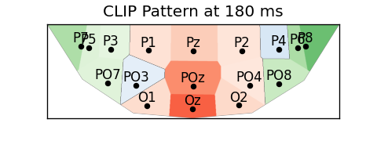

```
python scripts-thingseeg2_figures/plot_clip_patterns_negative.py
python scripts-thingseeg2_figures/plot_clip_patterns_negative_avg.py
```

+ For ICA-color patterns:

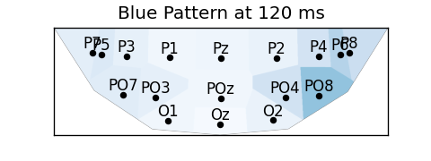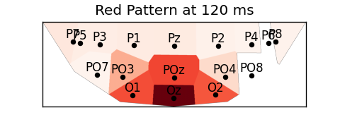

```
python scripts-thingseeg2_figures/plot_ica-color_patterns_negative.py
python scripts-thingseeg2_figures/plot_ica-color_patterns_negative_avg.py
```

+ For VDVAE-texture patterns:

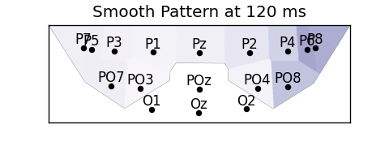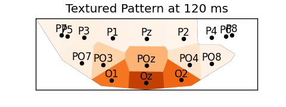

```
python scripts-thingseeg2_figures/plot_vdvae-texture_patterns_negative.py
python scripts-thingseeg2_figures/plot_vdvae-texture_patterns_negative_avg.py
```

+ For PCA-brightness patterns:

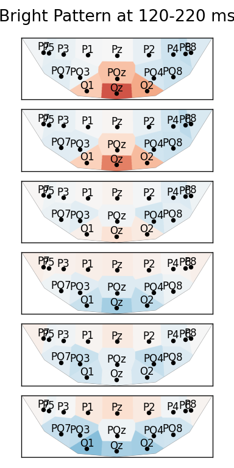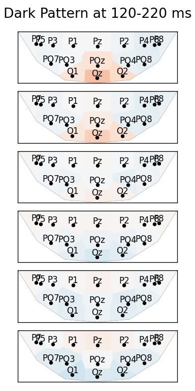

```
python scripts-thingseeg2_figures/plot_pca-brightness_patterns.py
python scripts-thingseeg2_figures/plot_pca-brightness_patterns_avg.py
```

## THINGS-EEG2 — Versatile Diffusion Pipeline:

### Setup

1. Create the python environment

+ For mac and linux:
```
virtualenv pyenv-vd --python=3.10.12
source pyenv-vd/bin/activate
pip install -r requirements-vd.txt
```
+ For Windows:
```
virtualenv pyenv-vd --python=3.10.12
pyenv-vd\Scripts\activate
pip install -r requirements-vd.txt
```

2. Same as unCLIP Pipeline Setup step 2.

3. Same as unCLIP Pipeline Setup step 3.

4. Download VDVAE and Versatile Diffusion weights
+ For mac and linux:
```
cd vdvae/model/
wget https://openaipublic.blob.core.windows.net/very-deep-vaes-assets/vdvae-assets-2/imagenet64-iter-1600000-log.jsonl
wget https://openaipublic.blob.core.windows.net/very-deep-vaes-assets/vdvae-assets-2/imagenet64-iter-1600000-model.th
wget https://openaipublic.blob.core.windows.net/very-deep-vaes-assets/vdvae-assets-2/imagenet64-iter-1600000-model-ema.th
wget https://openaipublic.blob.core.windows.net/very-deep-vaes-assets/vdvae-assets-2/imagenet64-iter-1600000-opt.th
cd ../../versatile_diffusion/pretrained/
wget https://huggingface.co/shi-labs/versatile-diffusion/resolve/main/pretrained_pth/vd-four-flow-v1-0-fp16-deprecated.pth
wget https://huggingface.co/shi-labs/versatile-diffusion/resolve/main/pretrained_pth/kl-f8.pth
wget https://huggingface.co/shi-labs/versatile-diffusion/resolve/main/pretrained_pth/optimus-vae.pth
cd ../../
```
+ For Windows:
```
cd vdvae/model/
curl.exe https://openaipublic.blob.core.windows.net/very-deep-vaes-assets/vdvae-assets-2/imagenet64-iter-1600000-log.jsonl
curl.exe https://openaipublic.blob.core.windows.net/very-deep-vaes-assets/vdvae-assets-2/imagenet64-iter-1600000-model.th
curl.exe https://openaipublic.blob.core.windows.net/very-deep-vaes-assets/vdvae-assets-2/imagenet64-iter-1600000-model-ema.th
curl.exe https://openaipublic.blob.core.windows.net/very-deep-vaes-assets/vdvae-assets-2/imagenet64-iter-1600000-opt.th
cd ../../versatile_diffusion/pretrained/
curl.exe https://huggingface.co/shi-labs/versatile-diffusion/resolve/main/pretrained_pth/vd-four-flow-v1-0-fp16-deprecated.pth
curl.exe https://huggingface.co/shi-labs/versatile-diffusion/resolve/main/pretrained_pth/kl-f8.pth
curl.exe https://huggingface.co/shi-labs/versatile-diffusion/resolve/main/pretrained_pth/optimus-vae.pth
cd ../../
```

5. Extract train and test latent embeddings from images and text labels
```
python scripts-thingseeg2_dataprep/extract_features-vdvae.py 
python scripts-thingseeg2_dataprep/extract_features-clipvision.py 
python scripts-thingseeg2_dataprep/extract_features-cliptext.py 
python scripts-thingseeg2_dataprep/evaluation_extract_features_from_test_images.py 
```

### Training and reconstruction
```
python scripts-thingseeg2/train_regression.py 
python scripts-thingseeg2/reconstruct_from_embeddings_vd.py 
python scripts-thingseeg2/evaluate_reconstruction.py 
python scripts-thingseeg2/plot_reconstructions.py -ordered True
```

### Reproducing figures
The reconstruction script assumes you have 7 GPUs, remove parallelism and set all GPUs to 0 if you only have 1 GPU.\

1. Reproducing `results/thingseeg2_preproc/fig_performance.png`:
```
scripts-thingseeg2_figures/train_all_subjects.sh
scripts-thingseeg2_figures/reconstruct_all_subjects.sh
scripts-thingseeg2_figures/evaluate_all_subjects.sh
python scripts-thingseeg2_figures/fig_performance.py
```

2. Reproducing `results/thingseeg2_preproc/fig_across_duration.png`:
```
scripts-thingseeg2_figures/train_across_duration.sh
scripts-thingseeg2_figures/reconstruct_across_duration.sh
scripts-thingseeg2_figures/evaluate_across_duration.sh
python scripts-thingseeg2_figures/fig_across_durations.py
```

3. Reproducing `results/thingseeg2_preproc/fig_ablations.png` (assuming you have completed `fig_performance.png`):
```
scripts-thingseeg2_figures/reconstruct_ablation.sh
scripts-thingseeg2_figures/evaluate_ablation.sh
python scripts-thingseeg2_figures/fig_ablations.py
```

4. Reproducing `results/thingseeg2_preproc/fig_CLIP_across_size_num_avg.png`:
```
scripts-thingseeg2_figures/train_across_size_num_avg.sh
scripts-thingseeg2_figures/reconstruct_across_size_num_avg.sh
scripts-thingseeg2_figures/evaluate_across_size_num_avg.sh
python scripts-thingseeg2_figures/fig_across_size_num_avg.py
```

## NSD — unCLIP Pipeline:

### Setup

1. Create the python environment, same as THINGS-EEG2 unCLIP Pipeline Setup step 1.

2. Download the preprocessed fMRI data 

```
python scripts-nsd_dataprep/download_nsd_data.py
cd data/nsd_metadata/
wget https://huggingface.co/datasets/pscotti/naturalscenesdataset/resolve/main/COCO_73k_annots_curated.npy
cd ../../
for sub in 1 2 5 7; do python scripts-nsd_dataprep/prepare_nsd_data.py -sub $sub; done
python scripts-nsd_dataprep/save_test_images.py
```

3. Extract train and test latent embeddings from images

```
python scripts-nsd_dataprep/extract_features-clip.py
python scripts-nsd_dataprep/extract_features-vae.py
python scripts-nsd_dataprep/evaluation_extract_features_from_test_images.py
```

4. Extract train and test PCA, ICA, and VDVAE latent embeddings from images

```
for sub in 1 2 5 7; do python scripts-nsd_dataprep/extract_features-pca.py -sub $sub; done
for sub in 1 2 5 7; do python scripts-nsd_dataprep/extract_features-ica.py -sub $sub; done
for sub in 1 2 5 7; do python scripts-nsd_dataprep/extract_features-vdvae.py -sub $sub; done
```

### Training and reconstruction
```
python scripts-nsd/train_regression_clip.py 
python scripts-nsd/train_regression_vae.py
python scripts-nsd/reconstruct_from_embeddings.py 
python scripts-nsd/evaluate_reconstruction.py 
```

### Reproducing figures
1. Install FreeSurfer
2. Reset PyCortex database location
+ For mac and linux:
```
rm ~/.config/pycortex/options.cfg
mv scripts-nsd_dataprep/defaults.cfg pyenv/lib/python3.10/site-packages/cortex/defaults.cfg
```
3. Plot patterns in subject-native space
```
for sub in 1 2 5 7; do python scripts-nsd/train_regression_clip.py  -sub $sub; done
for sub in 1 2 5 7; do python scripts-nsd/train_regression-encode_clip.py  -sub $sub; done
for sub in 1 2 5 7; do python scripts-nsd_figures/freesurfer_import_subj.py -sub $sub; done
for sub in 1 2 5 7; do python scripts-nsd_figures/make_clip_patterns_func1pt8mm.py -sub $sub; done

for sub in 1 2 5 7; do python scripts-nsd/train_regression_pca.py  -sub $sub; done
for sub in 1 2 5 7; do python scripts-nsd/train_regression-encode_pca.py  -sub $sub; done
for sub in 1 2 5 7; do python scripts-nsd_figures/make_pca-brightness_patterns_func1pt8mm.py -sub $sub; done

for sub in 1 2 5 7; do python scripts-nsd/train_regression_ica.py  -sub $sub; done
for sub in 1 2 5 7; do python scripts-nsd/train_regression-encode_ica.py  -sub $sub; done
for sub in 1 2 5 7; do python scripts-nsd_figures/make_ica-color_patterns_func1pt8mm.py -sub $sub; done

for sub in 1 2 5 7; do python scripts-nsd/train_regression_vdvae.py  -sub $sub; done
for sub in 1 2 5 7; do python scripts-nsd/reconstruct_from_embeddings_vdvae.py   -sub $sub; done
for sub in 1 2 5 7; do python scripts-nsd/train_regression-encode_vdvae.py  -sub $sub; done
for sub in 1 2 5 7; do python scripts-nsd_figures/make_vdvae-texture_patterns_func1pt8mm.py -sub $sub; done
```
4. Plot patterns in MNI space
+ For CLIP patterns:\
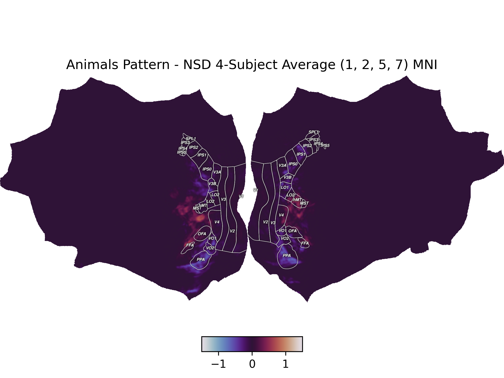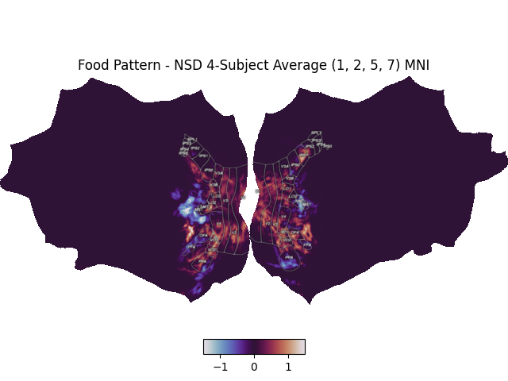

```
for sub in 1 2 5 7; do python scripts-nsd_figures/to_mni.py -sub $sub; done
for sub in 1 2 5 7; do python scripts-nsd_figures/plot_clip_patterns_mni.py -sub $sub; done
python scripts-nsd_figures/plot_clip_patterns_mni_avg.py
```
+ For PCA-brightness patterns:\

```
for sub in 1 2 5 7; do python scripts-nsd_figures/to_mni.py -sub $sub -pattern pca-brightness; done
for sub in 1 2 5 7; do python scripts-nsd_figures/plot_pca-brightness_patterns_mni.py -sub $sub; done
python scripts-nsd_figures/plot_pca-brightness_patterns_mni_avg.py
```
+ For ICA-color patterns:\
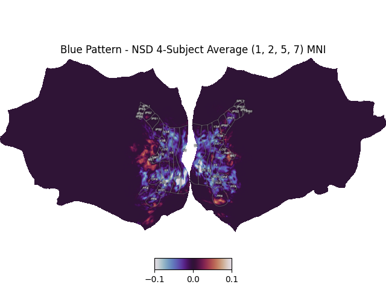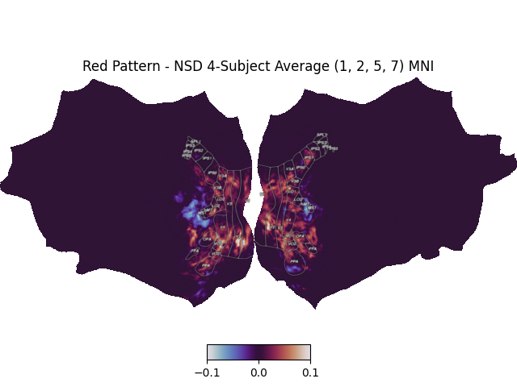
```
for sub in 1 2 5 7; do python scripts-nsd_figures/to_mni.py -sub $sub -pattern ica-color; done
for sub in 1 2 5 7; do python scripts-nsd_figures/plot_ica-color_patterns_mni.py -sub $sub; done
python scripts-nsd_figures/plot_ica-color_patterns_mni_avg.py
```
+ For VDVAE-texture patterns:\
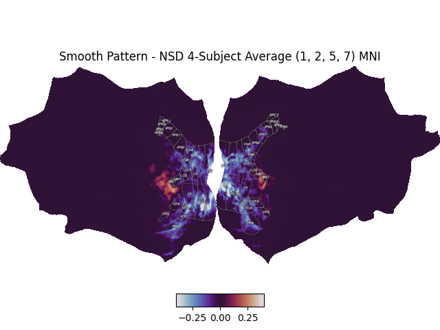
```
for sub in 1 2 5 7; do python scripts-nsd_figures/to_mni.py -sub $sub -pattern vdvae-texture; done
for sub in 1 2 5 7; do python scripts-nsd_figures/plot_vdvae-texture_patterns_mni.py -sub $sub; done
python scripts-nsd_figures/plot_vdvae-texture_patterns_mni_avg.py
```

## Acknowledgement
Ozcelik, F., & VanRullen, R. (2023). Natural scene reconstruction from fMRI signals using generative latent diffusion. Scientific Reports, 13(1), 15666. https://doi.org/10.1038/s41598-023-42891-8

Gifford, A. T., Dwivedi, K., Roig, G., & Cichy, R. M. (2022). A large and rich EEG dataset for modeling human visual object recognition. NeuroImage, 264, 119754. https://doi.org/10.1016/j.neuroimage.2022.119754

